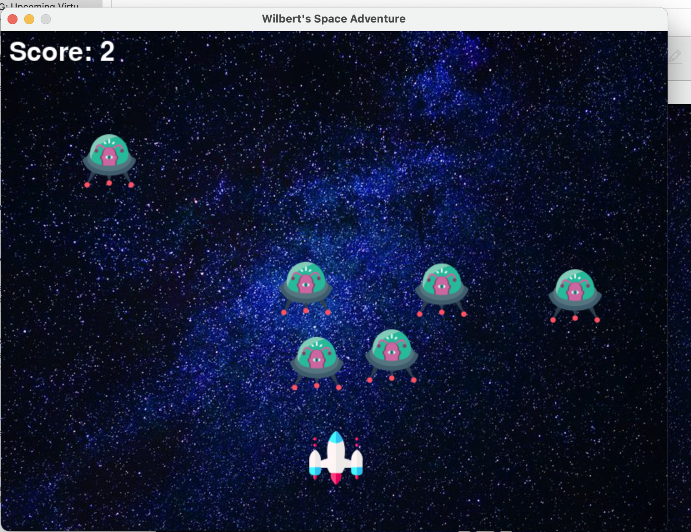
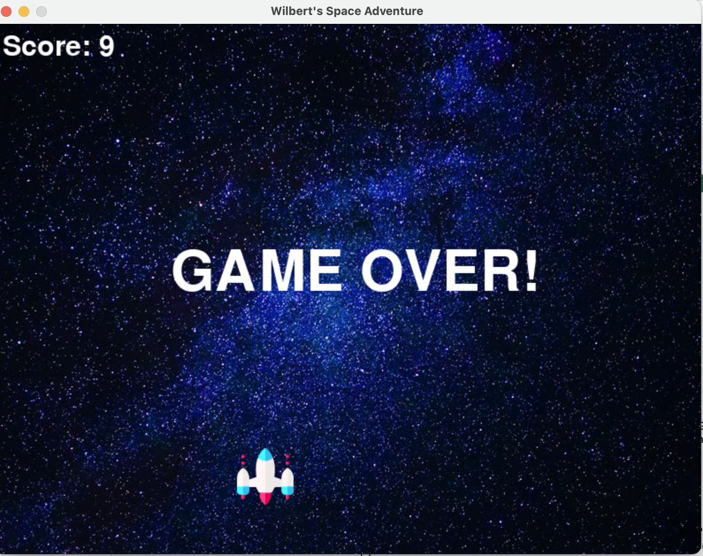
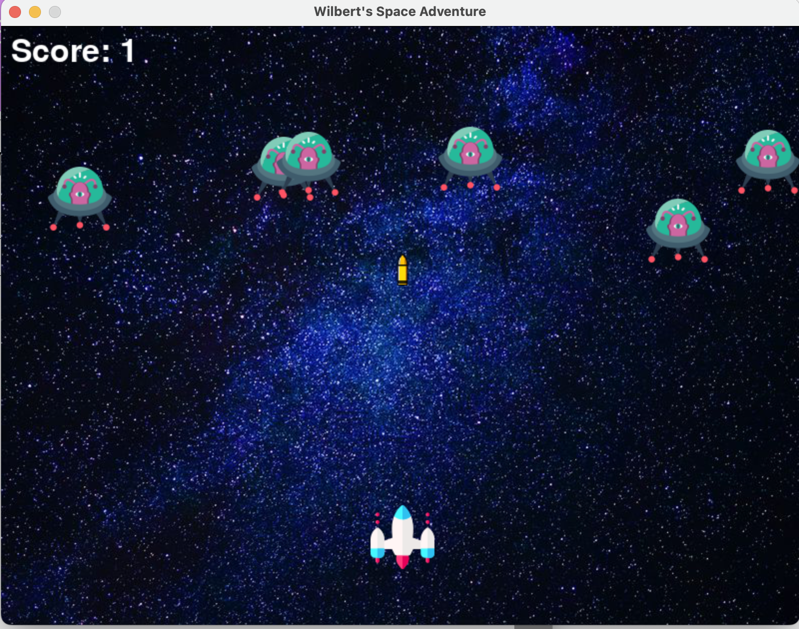

# Wilbert-s-Space-Adventure

This game is a rendition of the classic arcade game, Space Invaders. The object of the game is to amass a score as high as possible before the enemy invades the player's territory.

The implementation of this game was solely function-based.

Below is a working montage of the game

